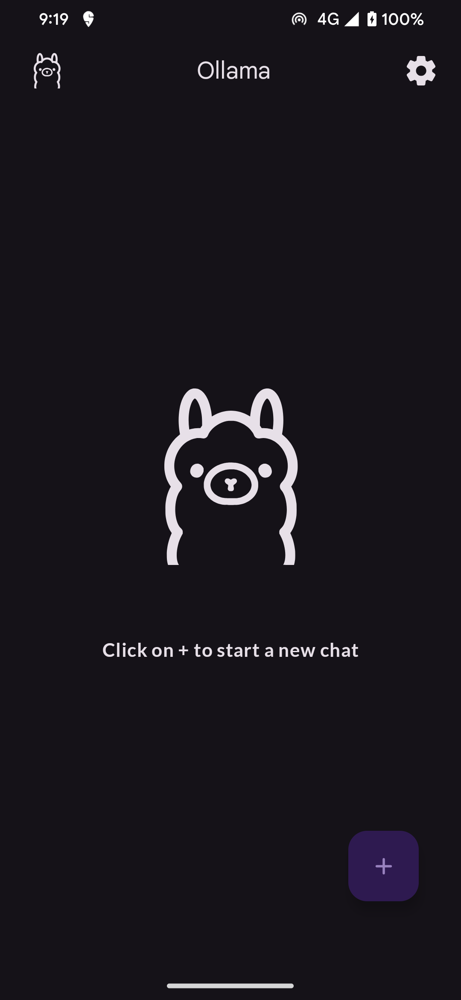
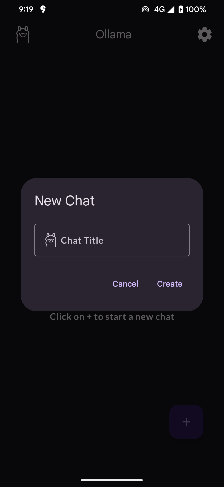
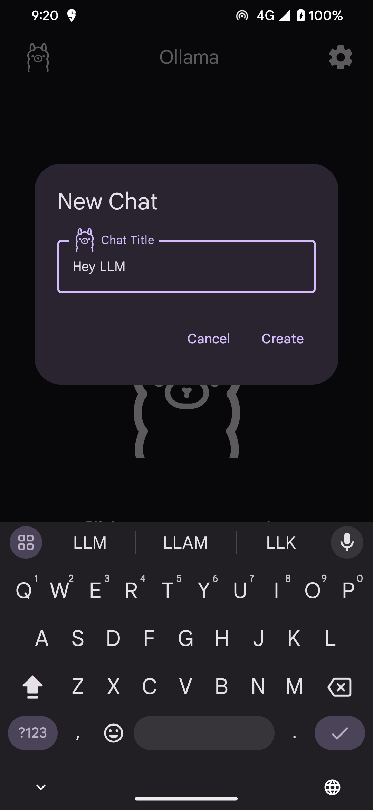
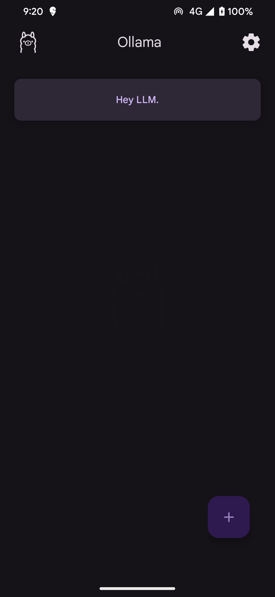
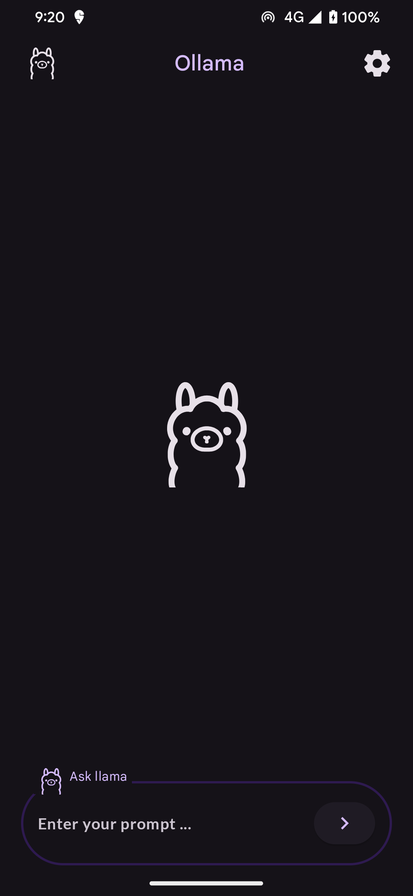
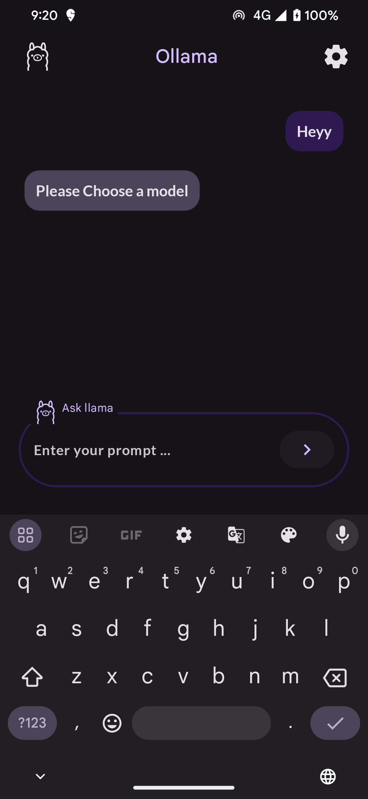
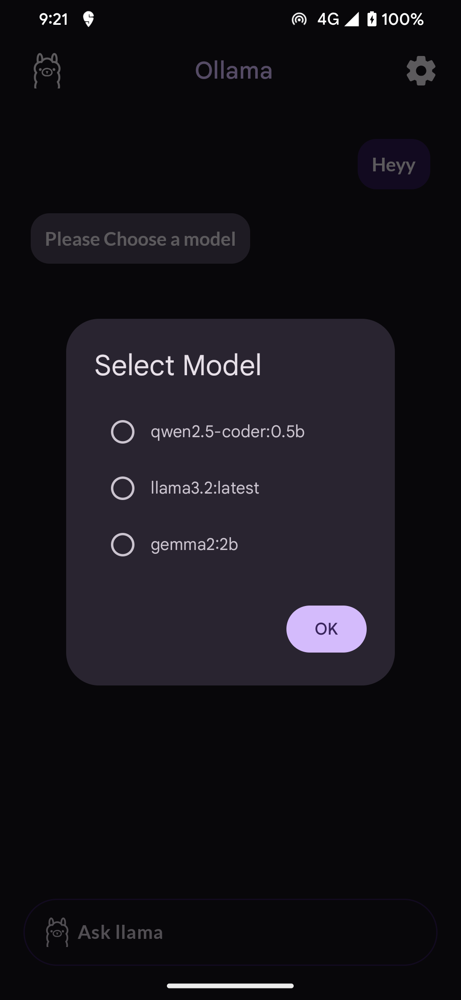
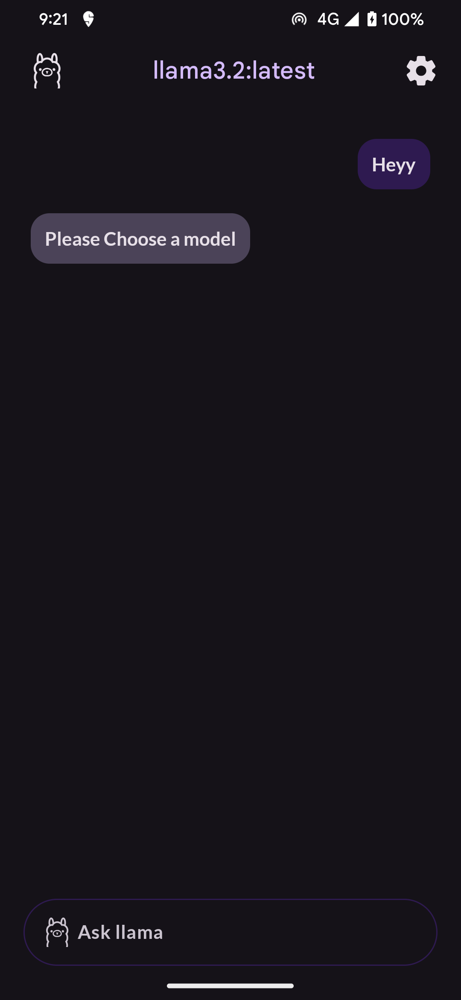
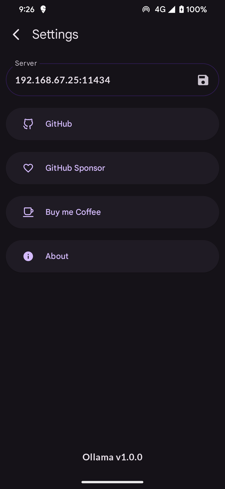
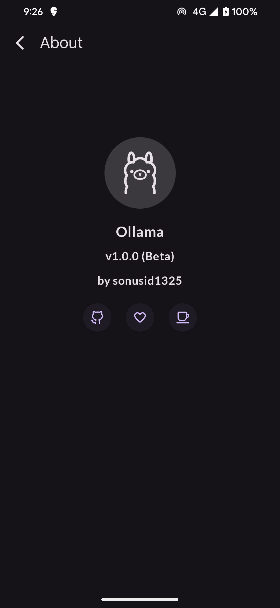

# LAMI Mobile (Android) Client

A personal assistant called LAMI, built to run entirely on-device. The Android client uses Jetpack Compose for an expressive animated UI, with an optional local LLM connection. No network dependency, no privacy tradeoffs.

## Features

- **Lightweight and fast**: Minimal UI optimized for mobile.
- **Fully local**: Works without internet, keeps your data on-device.
- **Expressive interface**: Sprite animations give visual feedback that makes interactions feel natural.
- **Flexible backend**: Local LLM integration is optional — core features work offline.

## Screenshots

### Home Screen
  

### New Chat
  

### Chat Interface
  

  

### Settings

  
  

## Sprite Animation (State-Driven)

LAMI switches between sprites based on internal state, giving visual feedback that matches what's actually happening. States transition on events and are managed in one place, keeping UI reactions consistent.

- **Idle**: Default expression when there's no input.
- **Thinking**: Processing input — suggests progress with a thinking animation.
- **TalkShort**: Playing back a short response.
- **TalkLong**: Playing back a longer response, for streaming output or detailed explanations.
- **TalkCalm**: Calm tone — indicates a relaxed, low-key conversation mode.
- **ErrorLight**: Minor error, like a retryable input issue.
- **ErrorHeavy**: Fatal error — connection failure or model crash. Visually emphasized.
- **Offline**: No network connection or model not running.

All states are managed by a single state machine. UI and backend events stay loosely coupled, which makes the system easy to extend and test.

## Verifying Sprite Adjustments

To confirm that changes made in the image adjustment tab propagate correctly to the gallery and animation tabs:

1. Go to `Settings > Sprite Debug`, open the canvas, and move any frame (e.g. frame #2) by a few pixels in the image adjustment tab.
2. Switch to the Animation tab in the same screen and visually confirm the frame preview reflects the change.
3. Open the Status tab gallery, select the same expression, and verify that `LamiStatusSprite` renders in the correct position.
4. Use the Reset button to return to the default 3x3 layout and repeat steps 1–3 if needed.

## Installation

1. **Download** the latest APK from [GitHub Releases](#).
2. **Install** the APK on your Android device.
3. **Launch the application** and start using LAMI.

## Requirements

- Android 13 or higher
- Minimum 4GB RAM (6GB+ recommended for better performance)
- (Optional) If you want local LLM support, set up a model that can run on-device before connecting.

## Usage

1. Open the application.
2. (Optional) Enable local LLM connection and load your model.
3. Start a new chat or resume an existing thread.
4. Watch the sprite expressions and notifications, and adjust settings as needed.

## Planned Features

- **Voice sync**: Lip sync and blinking tied to TTS timestamps.
- **Richer emotion**: Automatic expression and pose changes driven by sentiment analysis.
- **Expanded state machine**: New states tied to user behavior and notifications (e.g. Listening, Busy).
- **Plugin support**: Extension points for safe integration with local APIs and external services.

Users get richer interactions through voice and expressions. Developers can extend the state machine and sprite sets to build their own experiences on top.

## Contributing

Contributions are welcome. Fork the repo and open a pull request.

### Guidelines
- Follow standard Android development best practices.
- Keep UI/UX consistent with Jetpack Compose.
- Be mindful of performance.

## Development Setup

Minimum setup to run things locally and participate in the automated workflow.

1. Install required tools
```bash
   pip install --upgrade pre-commit commitizen
   pre-commit install --hook-type pre-commit --hook-type commit-msg
```
2. Set up Android SDK (if not already configured)
```bash
   sdkmanager --install "platform-tools" "platforms;android-34" "build-tools;34.0.0"
```
3. Run tests
```bash
   ./gradlew test
```
4. Auto-format before committing
```bash
   pre-commit run --all-files
```

A CI pipeline runs `./gradlew test` automatically on every pull request via GitHub Actions.

## License

MIT License

---

Developed with Jetpack Compose for Android.
